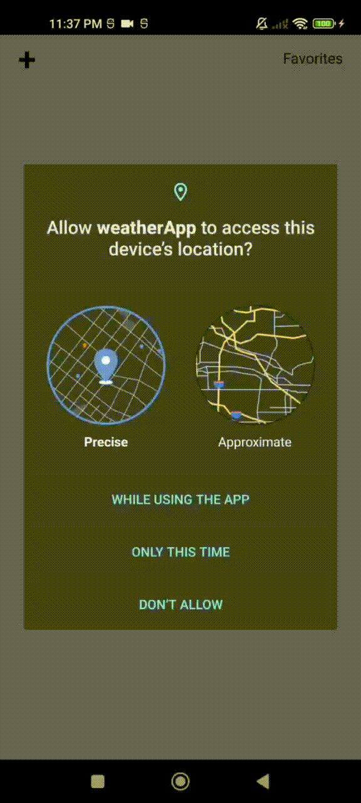

# Мобильное приложение "Weather App"
***



## Установка

Для начала запуска проекта требуется:
- [Node.js](https://nodejs.org/) v14+
- [Java JDK](https://www.oracle.com/java/technologies/downloads/) v11+
- [Android Studio](https://developer.android.com/studio) SDK21+
- [для IOS, Xcode](https://developer.apple.com/xcode) v12+
- А также убедитесь что есть поддержа системы языка C++

Перед запуском требуется установить API ключ для [OpenWeatherMap](https://openweathermap.org/api) в файле `src/api/index.ts` в переменную `API_KEY`.


После успешной установки программы, запустите следющие команды в терминале:

```sh
cd <путь к папке проекта>
npx npm i -g yarn
yarn 
```

Если ваша операционная система является Windows/Linux, тогда у вас будет возможность только для платформы ***Android***

```sh
yarn run android
```

Если операционная система является MacOS

```sh
yarn run ios
```

***
## Сборка
***

Чтобы собрать МП для платформы ***Android***:
- _MacOS_ `yarn run build:${mac}:android`
- _Windows_ `yarn run build:windows:android`
- _Linux_ `yarn run build:linux:android`

для платформы ***iOS***:
- _MacOS_ `yarn run build:mac:ios`


***Happy Coding!***
---
